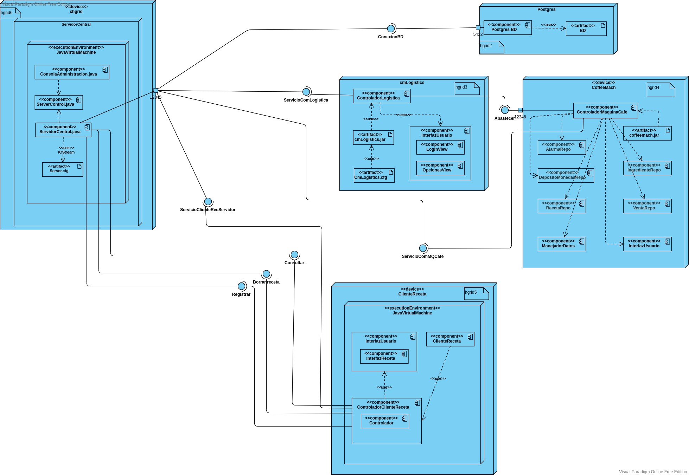

# Coffe machine deployment

# Members

Group: avengers

* Alejandra Díaz Parra
* Danna Sofía García Trujillo
* Giovanni Mosquera
* Nicolás Penagos
* Sebastián Rodríguez Salazar 
* Sebastián García Acosta 


## Getting started 

[Deployment diagram here](https://online.visual-paradigm.com/share.jsp?id=323236343337382d31)



# Requirements

* Java

* Zeroc ICE

* Postgres 

* Oracle BD


# Configuration

* xhgrid 10: DB postgres server

user: postgres
password: postgres

user: "avengers"
password: "cofmachpwd"
database name: "coffeemachine_avengers"

1. Create database in xhgrid2 with this command

```bash
psql -h xhgrid2 -U postgres -c "\i scripts/postgres/coffeemach-user.sql"
```

2. Execute scripts in order to create tables in the database

```bash
psql -h xhgrid2 -U avengers -d coffeemachine_avengers -c "\i scripts/postgres/coffeemach-ddl.sql"
```

3. Insert new rows in the created tables

```bash
psql -h xhgrid2 -U avengers -d coffeemachine_avengers -c "\i scripts/postgres/coffeemach-inserts.sql"
```


4. Compile the project 

```bash
# Cd into src_postgres folder
cd coffe-machine-deployment/java-components/coffeemach/src_postgres/

# Generate ice files to generate proxy classes
# after successfully running this, a folder called servivios should be created
slice2java CoffeMach.ice
# Compile
./gradlew build

```

5. Run!

```bash
java -jar ServidorCentral/build/libs/ServidorCentral.jar
java -jar ClienteRecetas/build/libs/ClienteRecetas.jar
java -jar coffeeMach/build/libs/coffeeMach.jar
java -jar cmLogistics/build/libs/cmLogistics.jar
```